********************
Guide d'utilisation
********************

Démarrage rapide
================
VigiBoard fournit une interface graphique accessible depuis un navigateur Web. La configuration par défaut est suffisante pour un démarrage rapide.

Accès à l'interface
-------------------
L'utilisation de VigiBoard se fait simplement en accédant, via votre navigateur, à l'adresse indiquée par votre administrateur. Par exemple : http://supervision.example.com/vigiboard/.

Authentification
----------------

..  note::
    Dans le cas où un mécanisme d'authentification externe a été défini par votre
    administrateur, il se peut qu'aucune authentification ne vous soit demandée, même lorsqu'il
    s'agit de votre première connexion. Le reste de ce chapitre décrit le cas où une
    authentification interne a lieu et ne s'applique donc pas au cas de figure cité ci-dessus.
    Contactez votre administrateur pour plus d'information sur la configuration utilisée.

Si vous ne vous êtes jamais connecté sur VigiBoard ou si vous n'êtes plus authentifié, le formulaire d'authentification de la figure suivante s'affiche:

    ..  figure:: img/login_form.png

        Écran d'authentification.

Selon le compte utilisateur auquel vous vous connecterez, vous disposerez d'un accès à plus ou moins d'hôtes et de services (et donc d'informations).
Les données d'authentification demandées ici vous ont normalement été transmises par votre administrateur.

- Saisir les données d'authentification en renseignant les zones de saisie « Identifiant » et « Mot de passe ».
- Valider la saisie en cliquant sur le bouton « Connexion » (entouré en rouge sur la figure suivante).

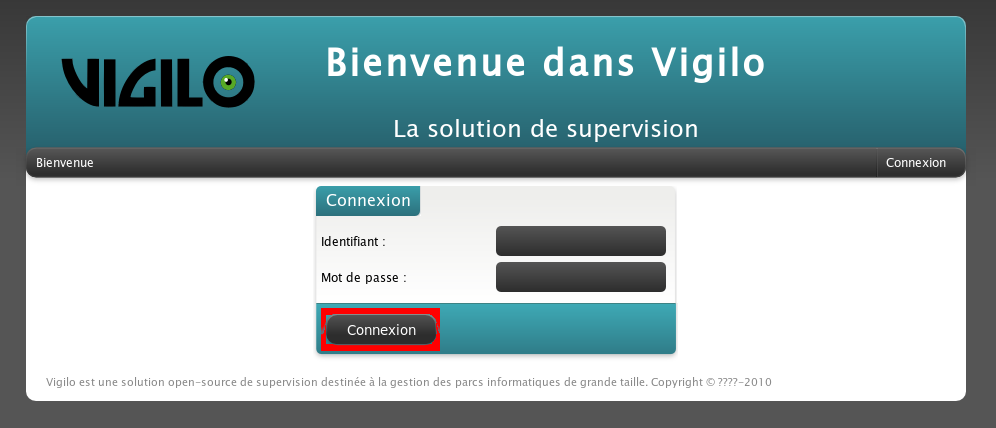

    Bouton de validation des données d'authentification.

En cas de succès, le bac à événements s'affiche. Sinon, le formulaire d'authentification s'affiche à nouveau, avec un message précisant la nature de l'erreur:

    ..  figure:: img/login_failure.png

        Formulaire après un échec de l'authentification.

Fonctionnalités
===============

Tableau des évènements
----------------------
Une fois la page d'authentification passée, le tableau des évènements
s'affiche, comme sur la figure qui suit.
Il s'agit de l'interface principale de VigiBoard.

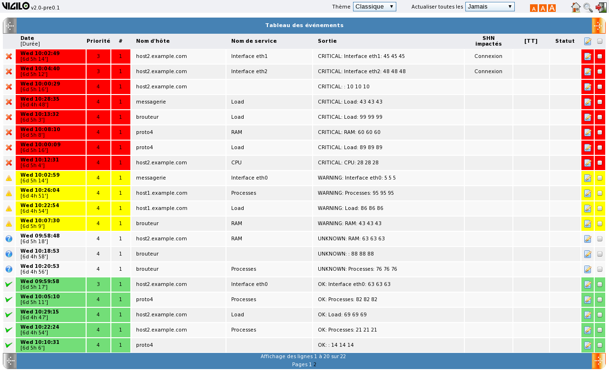

    Tableau des évènements.

Chaque ligne de ce tableau représente l'un des évènements corrélés (incidents)
détectés par Vigilo. Les informations suivantes y sont détaillées :

*   L'état de l'hôte ou du service sur lequel l'évènement est survenu,
    représenté par une icône en début de ligne, dont la signification
    est détaillée dans le tableau ci-après ;
*   La date à laquelle il a été détecté ;
*   La priorité avec laquelle il devrait être traité (sa gravité) ;
*   Le nombre d'alertes remontées par Vigilo le concernant ;
*   Le nom de l'hôte (et éventuellement du service) sur lequel il est survenu ;
*   Le message d'alerte ;
*   Les services de haut niveau impactés ;
*   Le numéro de ticket associé ;
*   Le statut de sa prise en compte par les opérateurs de supervision.

..  table:: Signification des icônes d'état

    +--------+---------------------------------+------------------------------------+
    | Icône  | État correspondant pour un hôte | État correspondant pour un service |
    +========+=================================+====================================+
    | |img2| | Down (En panne)                 | Critical (Critique)                |
    +--------+---------------------------------+------------------------------------+
    | |img3| | Unreachable (Injoignable)       | Unknown (Inconnu)                  |
    +--------+---------------------------------+------------------------------------+
    | |img4| | **n/a**                         | Warning (Avertissement)            |
    +--------+---------------------------------+------------------------------------+
    | |img5| | Up (Fonctionnel)                | OK (OK)                            |
    +--------+---------------------------------+------------------------------------+

.. |img2| image:: img/down_or_critical.png

.. |img3| image:: img/unreachable_or_unknown.png

.. |img5| image:: img/up_or_ok.png

Choix d'un thème
----------------
Plusieurs thèmes sont disponibles par défaut dans VigiBoard, dont un destiné
aux personnes malvoyantes et un autre prévu pour un usage dans des conditions
de faible luminosité. Un menu déroulant situé en haut de l'interface permet
de passer de l'un à l'autre sans avoir à recharger la page.

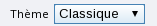

Le réglage du thème est ensuite conservé dans les autres écrans de l'application.

Thème Classique
^^^^^^^^^^^^^^^
Le thème *Classique* est utilisé par défaut dans VigiBoard.
Il est particulièrement adapté aux consoles de supervision grâce à son code
couleur qui fait ressortir l'état courant de l'hôte ou du service concerné
par un événement :

*   Le rouge indique que l'hôte ou le service concerné est dans un état
    critique (hôte en panne, service inopérant, etc.) ;
*   Le jaune indique un état dans lequel l'hôte ou le service concerné lève
    un avertissement (temps de réponse plus lent que la normale, consommation
    excessive de ressources, etc.) ;
*   L'absence de couleur signifie un état inconnu (impossibilité de contacter
    l'hôte ou de tester l'état du service par exemple) ;
*   Le vert représente un état dans lequel l'hôte ou le service concerné est
    fonctionnel (état nominal).

    Thème Classique

Thème Malvoyant
^^^^^^^^^^^^^^^
Ce thème est, comme son nom l'indique, destiné aux personnes malvoyantes
ou souffrant de troubles de perception des couleurs.
L'interface est ainsi épurée et dépourvue de couleurs.

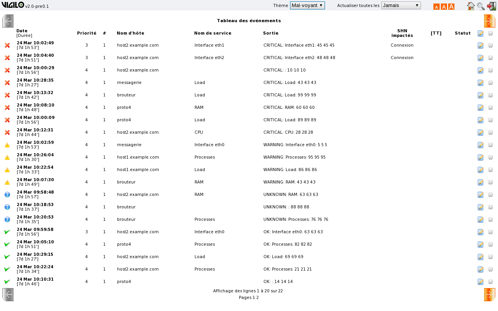

    Thème Malvoyant

Thème Nocturne
^^^^^^^^^^^^^^
Le thème *Nocturne* est conçu pour un affichage dans des conditions de faible
luminosité afin notamment de permettre la supervision de nuit.
Ses couleurs ambrées visent ainsi à reposer l'œil de l'opérateur,
mais sont en revanche contre-indiquées en cas de fort éclairage.

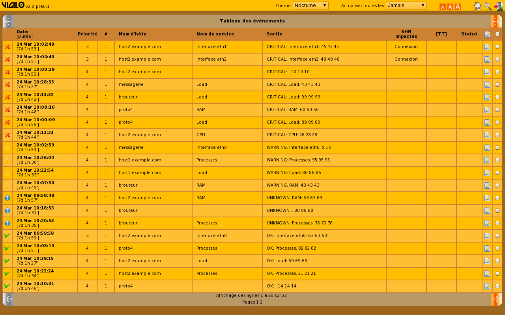

    Thème Nocturne

Rafraîchissement automatique de la page
---------------------------------------
Il est parfois souhaitable de rafraîchir régulièrement la page afin de prendre
en compte la détection de nouveaux évènements par Vigilo.
Une case à cocher placée en haut à droite de l'interface permet d'activer
ou de désactiver le rafraîchissement automatique.

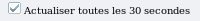

Le texte accompagnant la case à cocher peut varier en fonction de la
configuration retenue par votre administrateur. De même, l'état initial
de cette case à cocher est configuré par l'administrateur.
Ce paramétrage est mémorisé durant toute votre session de consultation de
VigiBoard. Il n'est donc pas nécessaire de le reconfigurer à chaque changement
de page.

..  note::
    Le rafraîchissement automatique est temporairement mis en pause lorsqu'une
    boîte de dialogue est affichée à l'écran. Dans ce cas, la case à cocher
    reste cochée, mais son effet est inhibée tant que toutes les boîtes de
    dialogue affichées à l'écran n'ont pas été refermées.

Réglage de la taille de la police
---------------------------------

La taille de la police est paramétrable en cliquant sur l'une
des trois icônes représentées ci-dessous et situées elles aussi
en haut à droite de l'interface ::

..  figure:: img/fontsize_selection.png

Trois tailles de polices de caractères sont disponibles :
petite, moyenne, grande.

Filtrage des événements
-----------------------
Il est possible de restreindre le nombre d'évènements affichés dans le tableau
grâce à l'outil de filtrage de VigiBoard. Celui-ci est accessible en cliquant
sur l'icône ci-dessous, placée en haut à droite de l'interface :

L'outil se présente sous la forme d'une boîte de dialogue permettant de filtrer
les évènements par groupes d'hôtes/services, par noms d'hôte ou de service,
par message d'erreur, par numéro de ticket d'incident, par date de début/fin,
etc.

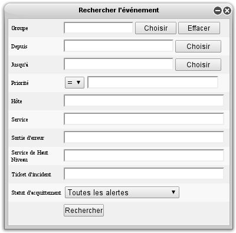

    Outil de recherche de VigiBoard.

..  note::
    À noter qu'un mécanisme d'auto-complétion permet de n'avoir à taper
    que les trois premières lettres de chaque champ avant de se voir proposer
    une liste de choix. L'outil autorise en outre l'utilisation des caractères
    jokers ``?`` et ``*`` pour représenter respectivement un caractère
    quelconque et une suite de caractères quelconques.

Édition d'un événement
----------------------

L'ouverture de la boîte de dialogue d'édition d'un événement se fait
en cliquant sur l'icône ci-dessous, placée à la fin de la ligne de
l'évènement en question ::

..  figure:: img/edit_icon.png

Il est alors possible de modifier l'identifiant du ticket d'incident associé
à cet événement, et de changer l'état d'acquittement de l'évènement
(« Non pris en compte », « Pris en compte », « Fermé »).

Un état supplémentaire est disponible pour les utilisateurs disposant
en plus de la permission d'administration de VigiBoard. Il s'agit de l'état
« Forcer à Fermé ». Lorsque cet état est choisi, l'incident est automatiquement
clos (dans l'historique, le dernier état de l'hôte ou du service concerné
est passé à « OK »). Cette option permet par exemple de traiter le cas où
un équipement qui faisait l'objet d'une alerte a été retiré du parc supervisé.
Étant donné que l'état de cet équipement ne peut plus être interrogé,
il ne pourra jamais repasser à un état nominal et l'événement associé
ne peut pas être supprimé par des méthodes conventionnelles.

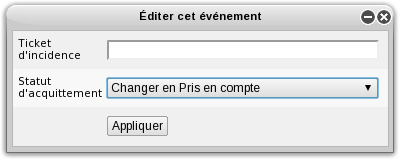

    Dialogue d'édition d'un évènement.

..  note::
    Notez qu'il est possible d'éditer plusieurs évènements simultanément en
    cochant les cases situées à la fin de leurs lignes respectives, puis en
    cliquant sur une icône semblable à la précédente, mais située cette fois
    à la droite de la ligne d'en-tête du tableau.

    ..  figure:: img/edit_icon_header.png

..  warning::
    Si vous sélectionnez plusieurs événements et que vous cliquez sur l'icône
    d'édition située à la fin de la ligne d'un événement, vous n'éditerez que
    les informations se rapportant à cet événement bien précis.

Fonctionnalités avancées
========================
En cliquant sur l'icône située au début de la ligne d'un évènement (qui
représente l'état de l'élément supervisé sur lequel cet incident est survenu),
une boîte de dialogue détaillant les informations sur l'évènement en question
s'ouvre.

Dans le premier tiers de cette boîte de dialogue sont visibles l'état initial
et l'état courant de l'événement, ainsi que le pire état de l'élément supervisé
sur lequel l'évènement est survenu.

Le second tiers donne ensuite accès à plusieurs fonctionnalités avancées :

*   L'historique détaillé de l'évènement corrélé, c'est à dire en réalité
    l'historique de l'évènement brut (alerte) causant cet évènement corrélé
    (se rapporter au glossaire pour la distinction entre événements bruts
    et corrélés) ;
*   La liste des évènements bruts masqués rattachés à cet événement corrélé ;
*   L'historique de tous les évènements corrélés survenus sur cet élément
    supervisé.

Enfin, le dernier tiers est constitué d'une liste de liens vers des
applications externes, telles que Nagios ou VigiGraph.

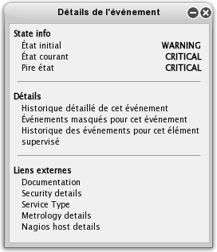

Historique d'un événement brut
------------------------------
Cette page détaille – comme son nom l'indique – l'historique d'un événement
brut, et liste notamment les alertes Nagios successives qui s'y rapportent.
Lorsque cet événement brut est la cause d'un événement corrélé, les
modifications apportées par les opérateurs au statut de l'évènement corrélé
en question sont également visibles.

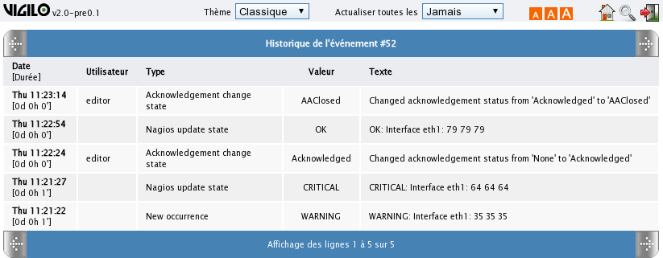

    Historique d'un évènement brut.

Liste des évènements bruts masqués
----------------------------------
Sur cette page sont affichés tous les évènements bruts rattachés à un événement
corrélé, sans en être la cause directe. Ils sont généralement la conséquence
d'un autre événement brut plus grave, détecté par le corrélateur comme la cause
principale de l'évènement corrélé.

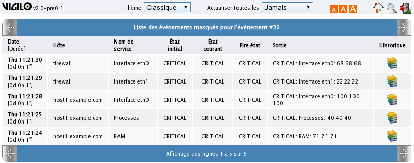

    Liste des évènements bruts masqués.

Historique d'un hôte ou d'un service
------------------------------------
Cette page permet de visualiser instantanément l'historique complet des
évènements corrélés survenus sur un élément supervisé donné (hôte ou service),
afin par exemple de détecter un problème récurrent. Ces évènements sont triés
par ordre anti-chronologique.

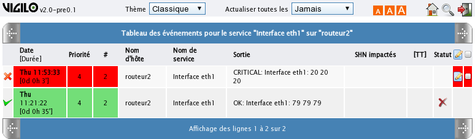

Inhibition des alertes
------------------------------------
Cette fonctionnalité permet d'empêcher l'apparition de nouvelles alertes dans
VigiBoard pour un hôte ou un service donné. La page listant les règles
d'inhibition (aussi appelées règles de mise en silence) actives est accessible
en cliquant sur l'icône ci-dessous située en haut à droite de l'interface :

Les règles sont triées par défaut par ordre décroissant de dernière mise à jour,
comme on peut le voir sur la capture ci-dessous :

.. Capture à ajouter

Depuis cette page, il est alors possible d'éditer ou de supprimer une règle
existante en cliquant sur l'une des deux icônes située en début de ligne :

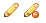

L'utilisateur est également en mesure d'ajouter une nouvelle règle en cliquant
sur le bouton prévu à cet effet situé juste au-dessus du tableau :

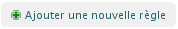

..  note::
    Les alertes déjà traitées (c'est à dire soit déjà ignorées, soit déjà
    affichées dans VigiBoard) ne sont pas impactées par les modifications faites
    sur les règles (ie. aucun traitement n'est réalisé a posteriori pour générer
    des alertes ou pour détruire des alertes déjà présentes).
    De même, ce filtrage n'impacte que la production d'alertes, il ne concerne
    pas l'état des hôtes/services (donc l'élément peut être ``CRITICAL`` dans
    VigiMap mais ne pas avoir d'alarme correspondante dans VigiBoard).

Annexes
=======

.. include:: ../../turbogears/doc/glossaire.rst

.. vim: set tw=79 :
